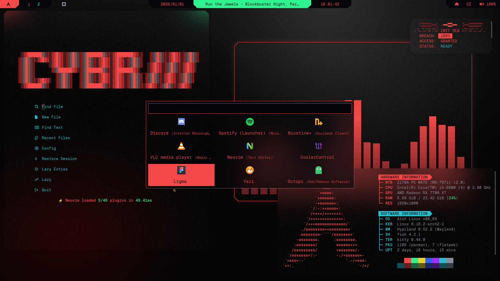
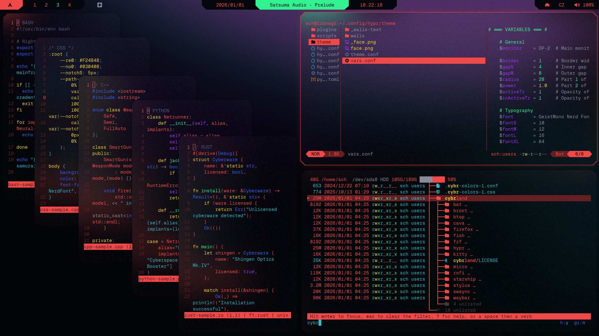
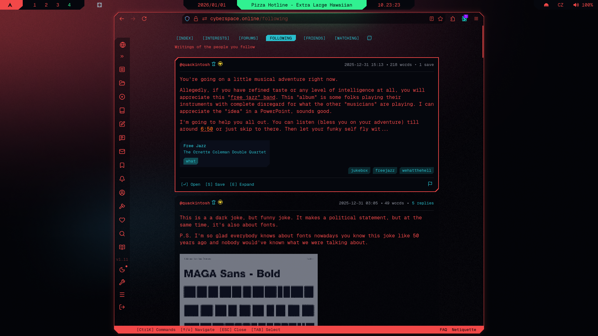
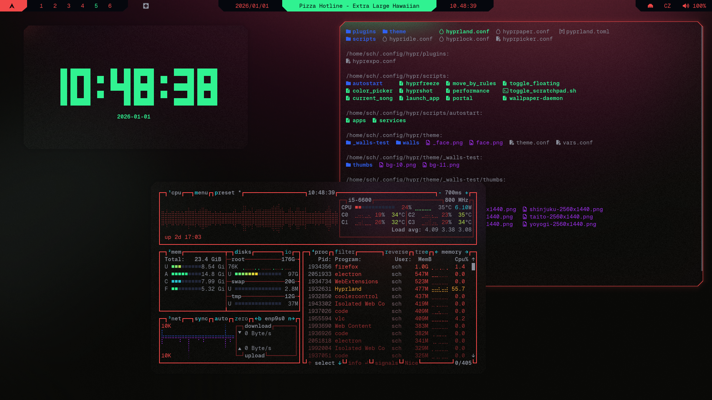
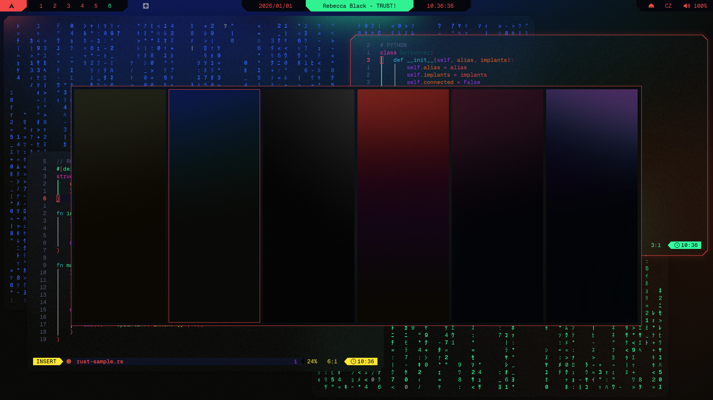

# Cybrland
**Cyberpunk dotfiles for Arch Hyprland, built on a deliberate [design philosophy](PHILOSOPHY.md)**

**Version:** v1.0.0  |  **Status:** Stable (2026-01-01)  

## Content
- [What's Inside](#whats-inside)
  - [Main](#main)
  - [Extras](#extras)
- [Showcase](#showcase)
- [Included Themes](#included-themes)
  - [Core System](#-core-system)
  - [Utilities](#-utilities)
  - [Testing](#-testing)
- [How To Install](#how-to-install)
- [Related Projects](#related-projects)
- [Roadmap](#roadmap)
  - [v1.0.0](#v100-2025-12-31)
  - [v1.5.0](#v150-early-mid-2026)
  - [v2.0.0](#v200-mid-late-2026)
- [Credits & Inspiration](#credits--inspiration)
- [License](#license)

## What's Inside
### Main
- **Unified aesthetic** - Custom cyberpunk palette + Geist Mono Nerd Font across 15+ applications
- **Terminal-centric** - Fast, integrated TUI/CLI workflow with seamless component interaction
- **Modular & flexible** - Install everything or cherry-pick components
- **Documented** - Guides and comments for beginners + power-user patterns (systemd, sparse checkout)

### Extras
- **Wallpaper rotation daemon** - Pseudo-random cycling (never repeats consecutively; wallpapers included)
- **Desktop brightness control** - Mousewheel adjustment via DDC/CI (OSD-free)

## Showcase

  <em>Left-to-right: Neovim, rofi-launcher, cava, fastfetch, custom script ↗</em>

 

  <em>Left-to-right: stacked micro, yazi, broot ↗</em>

 

  <em>Firefox w/Cybrspace.online custom theme ↗</em>

 

  <em>Left-to-right: clock, btop, ls ↗</em>

 

  <em>Fore-to-back: wallpaper selector, neovim, matrix ↗</em>

 

  <em>Firefox w/Sidebery ↗</em>

  <em>swaync ↗ (floating notifications; control center; control center list)</em>

## Included Themes

### 🟢 Core System
Complete themes with full documentation:

- **[hyprland](./hypr/readme.md)** - Tiling window manager
- **[kitty](./kitty/readme.md)** - Terminal emulator
- **[fish](./fish/readme.md)** - User-friendly shell
- **[waybar](./waybar/readme.md)** - Status bar with custom modules
- **[rofi](./rofi/readme.md)** - Application launcher & menus
- **[swaync](./swaync/readme.md)** - Notification daemon
- **[starship](./starship/readme.md)** - Cross-shell prompt

### 🟢 Utilities
- **[btop](./btop/readme.md)** - TUI System resource monitor
- **[yazi](./yazi/readme.md)** - TUI Terminal file manager
- **[broot](./broot/readme.md)** - CLI Directory navigator
- **[fzf](./fzf/readme.md)** - CLI Fuzzy finder
- **[micro](./micro/readme.md)** - TUI Lightweight text editor
- **[cava](./cava/readme.md)** - CLI Audio visualizer
- **[bat](./bat/readme.md)** - CLI Syntax-highlighted file viewer 
- **[fastfetch](./fastfetch/readme.md)** - CLI System information tool  

### 🟡 Testing
- **[neovim](./nvim/readme.md)** - Beta - *Fully themed; polishing*
- **[firefox](./firefox/readme.md)** - Alpha - *Themed; major refactor planned*
- **Cybrcursors** - Alpha - *Fully themed; polishing*
- **VSCode** - Alpha - *Early stage*
- **Obsidian** - Alpha - *Plugin-based, standalone theme planned*

## How To Install
1. Follow the [Installation Guide](INSTALL.md) for in-depth guidance, installation order, backups creation and troubleshooting (**safest & recommended; beginner-friendly**)
2. Read individual readme.md files in this repo for modular installation

## Related Projects
- [Cybrpapers](https://github.com/scherrer-txt/cybrpapers) - Hand-crafted wallpaper collection
- [Cybrcolors](https://github.com/scherrer-txt/cybrcolors) - Unified color palette
- Cybrcursors - Custom mouse cursors ([preview](https://8upload.com/image/d91ecbad191c4ec9/image_3.jpg))

## Roadmap

### v1.0.0 (2025-12-31)
- [x] Cybrland v1.0.0
  - [x] Documentation & install guides  
  - [x] Themes
    - [x] hyprland, kitty, fish, waybar, rofi, swaync, starship
    - [x] btop, yazi, broo , fzf, micr , cava, bat
    - [x] neovim (*beta*)
    - [x] firefox (*alpha*)
- [x] Cybrcolors v1.0
- [x] Cybrpapers v1.0

### v1.5.0 (Early-mid 2026)
- [ ] Cybrland: Installer script & override patterns
- [ ] Cybrland: Extended multi-distro support documentation
- [ ] Cybrland: System-wide unification of syntax highlights, based on [tonsky's](https://github.com/tonsky) highlight [philosophy](https://tonsky.me/blog/syntax-highlighting/)
- [ ] Cybrland: Finish alpha themes (Firefox, VSCode, Obsidian)
- [ ] Cybrland: Music player theme (rmpc/Spicetify)
- [ ] Cybrland: Chat app theme (Vencord)
- [ ] Cybrland: Theme switcher
- [ ] Cybrpapers v2.0: Additional Cybrpaper wallpapers
- [ ] Cybrcursors v1.0
- [ ] Cybrscreen v1.0: Screensaver(s)

**Under consideration:**
- Replace waybar/swaync/rofi with quickshell
- Alternative launcher (Vicinae or Walker)

### v2.0.0 (Mid-late 2026)
- [ ] Cybrland: GTK theme  
- [ ] ???  

## Credits & Inspiration

This project builds on the work of many talented creators:

**Dotfile foundations:**
- [Matt-FTW/dotfiles](https://github.com/Matt-FTW/dotfiles) - Many of Hyprland configs are based on their dotfiles, theirs was my first Hyprland theme, and thanks to them I discovered Catppuccin

**Theming & aesthetics:**
- [Catppuccin](https://github.com/catppuccin/catppuccin) - This project showed me what's possible with themes, it's overall scope is inspiration and aspiration at the same time
- [Cyberpunk 2077 UI Bible](https://www.behance.net/gallery/118663901/Cyberpunk-2077User-Interface-(Part-1)) - Endless source of inspiration and ideas (s/o [Vladimír Vilimovský](https://www.behance.net/vladimirvilimovsky), [Jakub Knapik](https://www.linkedin.com/in/jakub-knapik-56741931), [Robert Bielecki](http://robertbielecki.com/), [Imanol Delago Salazar](https://www.artstation.com/artwork/WKzrBG), [Marcin Stepien](https://www.artstation.com/artwork/GaVGaz), [Simon Besombes](https://www.artstation.com/artwork/285r4a), [Kamil Piotrowski](https://www.artstation.com/artwork/285lYa), [Zuzanna Dabrowa](https://www.artstation.com/artwork/d8RnZ1), [Wojciech Chalinski](https://www.artstation.com/artwork/2855DY), [Pawel Matuszak](https://www.artstation.com/artwork/NxeNDN), [Mateusz Walus](https://www.artstation.com/artwork/5X4OLO) and the army of unnamed and uncredited from CD Projekt RED, who made Cyberpunk 2077 possible)

**Community:**
- [r/unixporn](https://reddit.com/r/unixporn) - Their [feedback](https://www.reddit.com/r/unixporn/comments/1ouzvfy/hyprland_cybrland_v010/) was the biggest impulse for me to release the dotfiles.
- [Cyberspace.online](https://cyberspace.online) - Absolutely great community where I found my digital home after many years of wandering and lurking. Their support was of immensely important to keep me going.

If I missed anyone, feel free to open an issue!

## License
