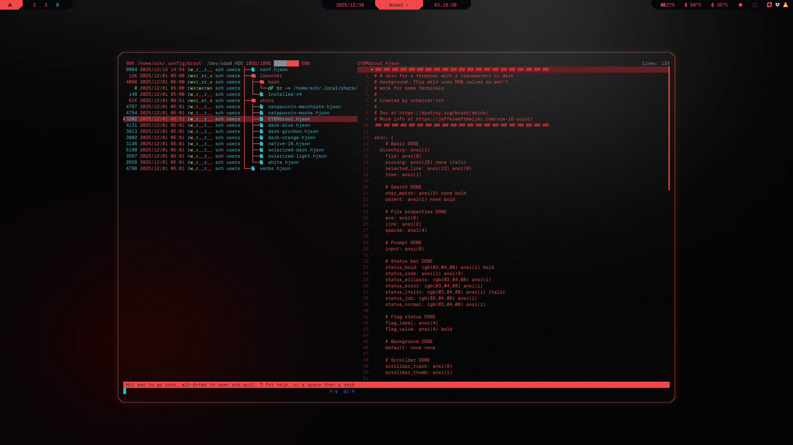

```
░▒▓███████▓▒░░▒▓███████▓▒░ ░▒▓██████▓▒░ ░▒▓██████▓▒░▒▓████████▓▒░ 
░▒▓█▓▒░░▒▓█▓▒░▒▓█▓▒░░▒▓█▓▒░▒▓█▓▒░░▒▓█▓▒░▒▓█▓▒░░▒▓█▓▒░ ░▒▓█▓▒░     
░▒▓█▓▒░░▒▓█▓▒░▒▓█▓▒░░▒▓█▓▒░▒▓█▓▒░░▒▓█▓▒░▒▓█▓▒░░▒▓█▓▒░ ░▒▓█▓▒░     
░▒▓███████▓▒░░▒▓███████▓▒░░▒▓█▓▒░░▒▓█▓▒░▒▓█▓▒░░▒▓█▓▒░ ░▒▓█▓▒░     
░▒▓█▓▒░░▒▓█▓▒░▒▓█▓▒░░▒▓█▓▒░▒▓█▓▒░░▒▓█▓▒░▒▓█▓▒░░▒▓█▓▒░ ░▒▓█▓▒░     
░▒▓█▓▒░░▒▓█▓▒░▒▓█▓▒░░▒▓█▓▒░▒▓█▓▒░░▒▓█▓▒░▒▓█▓▒░░▒▓█▓▒░ ░▒▓█▓▒░     
░▒▓███████▓▒░░▒▓█▓▒░░▒▓█▓▒░░▒▓██████▓▒░ ░▒▓██████▓▒░  ░▒▓█▓▒░     
```

> [!NOTE]
> broot uses ANSI colors defined by [kitty](../kitty/readme.md), so be sure to have kitty installed and configured first!

## Result
</td>

## Steps
### 1. Install broot
```sh
sudo pacman -S broot
```
### 2. Create theme folder and file
```sh
mkdir -p ~/.config/broot/skins
$EDITOR ~/.config/broot/skins/CYBRbroot.hjson
```
### 3. Insert [CYBRbroot](CYBRbroot.hjson)
### 4. Apply theme
```sh
# Open config
$EDITOR ~/.config/broot/config.hjson

# Enable True Colors and Icons
true_colors: true
icon_theme: nerdfont

# Add skin under luma: [dark] section
file: skins/CYBRbroot.hjson

# It should look like this:
{
luma: [
	dark
	unknown
]
//file: foo.hjson
//file: bar.hjson
file: skins/CYBRbroot.hjson
}
```
### 5. Restart terminal
```sh
pkill $TERM
```