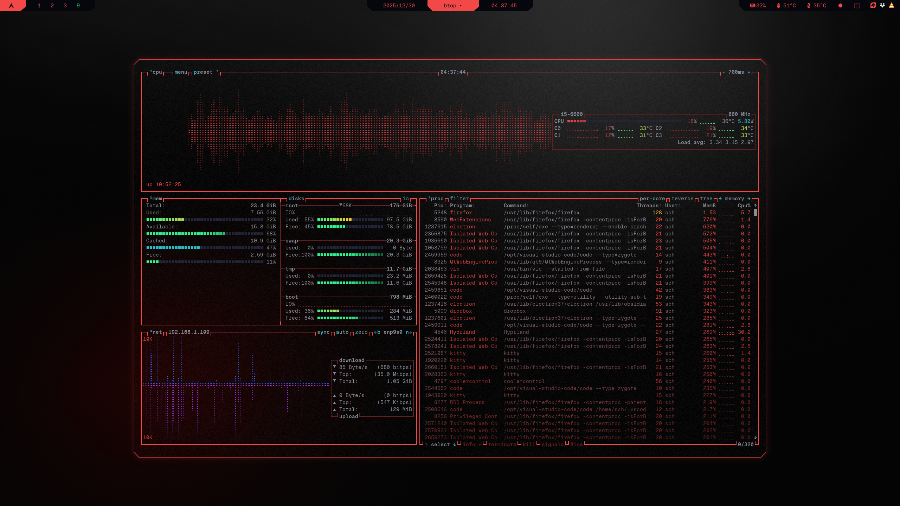

```
░▒▓███████▓▒░▒▓████████▓▒░▒▓██████▓▒░░▒▓███████▓▒░  
░▒▓█▓▒░░▒▓█▓▒░ ░▒▓█▓▒░  ░▒▓█▓▒░░▒▓█▓▒░▒▓█▓▒░░▒▓█▓▒░ 
░▒▓█▓▒░░▒▓█▓▒░ ░▒▓█▓▒░  ░▒▓█▓▒░░▒▓█▓▒░▒▓█▓▒░░▒▓█▓▒░ 
░▒▓███████▓▒░  ░▒▓█▓▒░  ░▒▓█▓▒░░▒▓█▓▒░▒▓███████▓▒░  
░▒▓█▓▒░░▒▓█▓▒░ ░▒▓█▓▒░  ░▒▓█▓▒░░▒▓█▓▒░▒▓█▓▒░        
░▒▓█▓▒░░▒▓█▓▒░ ░▒▓█▓▒░  ░▒▓█▓▒░░▒▓█▓▒░▒▓█▓▒░        
░▒▓███████▓▒░  ░▒▓█▓▒░   ░▒▓██████▓▒░░▒▓█▓▒░        
```

</td>

# Steps
## 0. Before you start
- Make sure [Geist Mono Nerd Font](../INSTALL.md#prerequisites--setup) is installed
- Make sure kitty is installed: `sudo pacman -S kitty` and theme is applied
- Make sure btop is installed: `sudo pacman -S btop`
- See [Installation Guide](../INSTALL.md) if you haven't set up prerequisites yet
- [Github](https://github.com/aristocratos/btop)

## 1. Create theme folder and file
```sh
mkdir -p ~/.config/btop/themes
$EDITOR ~/.config/btop/themes/CYBRtop.theme
```
## 2. Insert [CYBRtop](../btop/CYBRtop.theme)
## 3. Apply theme
```sh
btop

# Press ESC -> Options
# Select Color theme, then select CYBRtop with left/right arrow keys
# You can exit btop by pressing Q
```
