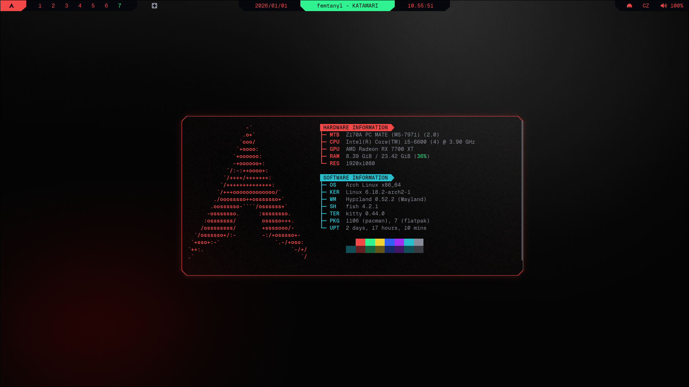

```
░▒▓████████▓▒░▒▓██████▓▒░ ░▒▓███████▓▒░▒▓████████▓▒░▒▓████████▓▒░ 
░▒▓█▓▒░     ░▒▓█▓▒░░▒▓█▓▒░▒▓█▓▒░         ░▒▓█▓▒░   ░▒▓█▓▒░        
░▒▓█▓▒░     ░▒▓█▓▒░░▒▓█▓▒░▒▓█▓▒░         ░▒▓█▓▒░   ░▒▓█▓▒░        
░▒▓██████▓▒░░▒▓████████▓▒░░▒▓██████▓▒░   ░▒▓█▓▒░   ░▒▓██████▓▒░   
░▒▓█▓▒░     ░▒▓█▓▒░░▒▓█▓▒░      ░▒▓█▓▒░  ░▒▓█▓▒░   ░▒▓█▓▒░        
░▒▓█▓▒░     ░▒▓█▓▒░░▒▓█▓▒░      ░▒▓█▓▒░  ░▒▓█▓▒░   ░▒▓█▓▒░        
░▒▓█▓▒░     ░▒▓█▓▒░░▒▓█▓▒░▒▓███████▓▒░   ░▒▓█▓▒░   ░▒▓█▓▒░        
```

</td>

# Steps
## 0. Before you start
- Make sure kitty is installed: `sudo pacman -S kitty` and theme is applied
- Make sure fish is installed: `sudo pacman -S fish` and theme is applied
- See [Installation Guide](../INSTALL.md) if you haven't set up prerequisites yet
- [Github](https://github.com/fastfetch-cli/fastfetch)

## 1. Create theme folder and file
```sh
mkdir -p ~/.config/fastfetch/config.jsonc
$EDITOR ~/.config/fastfetch/config.jsonc
```
## 2. Insert [CYBRfetch](config.jsonc)
## 3. Use
```sh
fastfetch
```