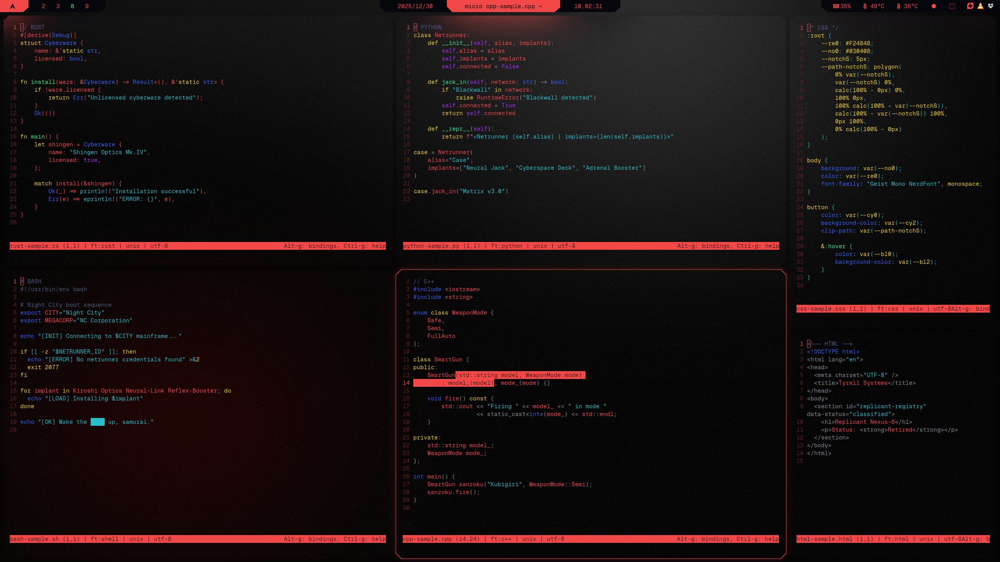

```
░▒▓█▓▒░░▒▓█▓▒░▒▓█▓▒░▒▓████████▓▒░▒▓████████▓▒░▒▓█▓▒░░▒▓█▓▒░ 
░▒▓█▓▒░░▒▓█▓▒░▒▓█▓▒░  ░▒▓█▓▒░      ░▒▓█▓▒░   ░▒▓█▓▒░░▒▓█▓▒░ 
░▒▓█▓▒░░▒▓█▓▒░▒▓█▓▒░  ░▒▓█▓▒░      ░▒▓█▓▒░   ░▒▓█▓▒░░▒▓█▓▒░ 
░▒▓███████▓▒░░▒▓█▓▒░  ░▒▓█▓▒░      ░▒▓█▓▒░    ░▒▓██████▓▒░  
░▒▓█▓▒░░▒▓█▓▒░▒▓█▓▒░  ░▒▓█▓▒░      ░▒▓█▓▒░      ░▒▓█▓▒░     
░▒▓█▓▒░░▒▓█▓▒░▒▓█▓▒░  ░▒▓█▓▒░      ░▒▓█▓▒░      ░▒▓█▓▒░     
░▒▓█▓▒░░▒▓█▓▒░▒▓█▓▒░  ░▒▓█▓▒░      ░▒▓█▓▒░      ░▒▓█▓▒░     
```

## Result
</td>
<p align="center">
  <em>kitty ↗ (top-left to bottom-right: rust, python, css; bash, c++, html)</em>
</p>

## Steps
### 0. Before you start
- Make sure [Geist Mono Nerd Font](../INSTALL.md##Prerequisites&Setup) is installed
- Make sure kitty is installed: `sudo pacman -S kitty`
- See [Installation Guide](../INSTALL.md) if you haven't set up prerequisites yet

### 1. Create theme folder and file
```sh
mkdir -p ~/.config/kitty/themes
$EDITOR ~/.config/kitty/themes/CYBRkitty.conf
```
### 2. Insert [CYBRkitty](../kitty/CYBRkitty.conf)
### 3. Insert [kitty.conf](../kitty/kitty.conf)
```sh
$EDITOR ~/.config/kitty/themes/CYBRkitty.conf
```
### 4. Restart kitty and apply theme
```sh
pkill kitty && include themes/CYBRkitty.conf
```