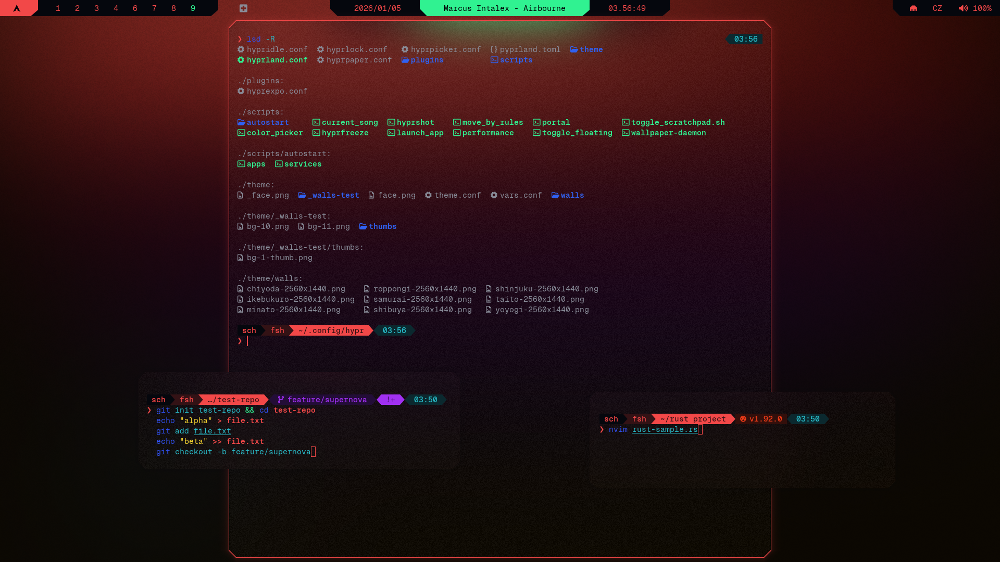

```
 ░▒▓███████▓▒░▒▓████████▓▒░▒▓███████▓▒░ ░▒▓███████▓▒░▒▓█▓▒░░▒▓█▓▒░▒▓███████▓▒░  
░▒▓█▓▒░         ░▒▓█▓▒░   ░▒▓█▓▒░░▒▓█▓▒░▒▓█▓▒░      ░▒▓█▓▒░░▒▓█▓▒░▒▓█▓▒░░▒▓█▓▒░ 
░▒▓█▓▒░         ░▒▓█▓▒░   ░▒▓█▓▒░░▒▓█▓▒░▒▓█▓▒░      ░▒▓█▓▒░░▒▓█▓▒░▒▓█▓▒░░▒▓█▓▒░ 
 ░▒▓██████▓▒░   ░▒▓█▓▒░   ░▒▓███████▓▒░ ░▒▓██████▓▒░░▒▓████████▓▒░▒▓███████▓▒░  
       ░▒▓█▓▒░  ░▒▓█▓▒░   ░▒▓█▓▒░░▒▓█▓▒░      ░▒▓█▓▒░▒▓█▓▒░░▒▓█▓▒░▒▓█▓▒░        
       ░▒▓█▓▒░  ░▒▓█▓▒░   ░▒▓█▓▒░░▒▓█▓▒░      ░▒▓█▓▒░▒▓█▓▒░░▒▓█▓▒░▒▓█▓▒░        
░▒▓███████▓▒░   ░▒▓█▓▒░   ░▒▓█▓▒░░▒▓█▓▒░▒▓███████▓▒░░▒▓█▓▒░░▒▓█▓▒░▒▓█▓▒░        
```

</td>
<p align="center">
  <em>starship ↗ (left to right: terminal, terminal, directory, git)</em>
</p>

# Steps
## 0. Before you start
- Make sure [Geist Mono Nerd Font](../INSTALL.md#prerequisites--setup) is installed
- Make sure fish is installed: `sudo pacman -S fish` with theme and config applied
- See [Installation Guide](../INSTALL.md) if you haven't set up prerequisites yet
- [Github](https://github.com/starship/starship)

## 1. Create config file

```sh
micro ~/.config/starship.toml
```
## 2. Insert [CYBRship](../starship/CYBRship.toml)

## 3. Enable transcience in fish
### Open config.fish
```sh
micro ~/.config/fish/config.fish
```
### Insert at the end:
```json
enable_transience
function starship_transient_prompt_func
  starship module character
end
function starship_transient_rprompt_func
  starship module custom.transient_time
end
starship init fish | source
```
### Restart 
```sh
exec fish
```

## 4. Test

```bash
which starship
starship explain
starship print-config | head -n 5

# Should explain and display starship.toml config

#### If not

echo $STARSHIP_CONFIG

# Should point to ~/.config/starship.toml

#### Then run:

set -gx STARSHIP_CONFIG ~/.config/starship.toml
starship init fish | source
```
