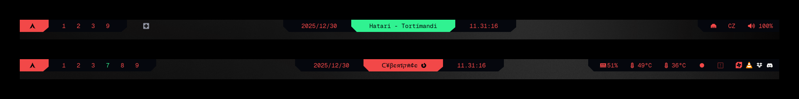

```
░▒▓█▓▒░░▒▓█▓▒░░▒▓█▓▒░░▒▓██████▓▒░░▒▓█▓▒░░▒▓█▓▒░▒▓███████▓▒░ ░▒▓██████▓▒░░▒▓███████▓▒░  
░▒▓█▓▒░░▒▓█▓▒░░▒▓█▓▒░▒▓█▓▒░░▒▓█▓▒░▒▓█▓▒░░▒▓█▓▒░▒▓█▓▒░░▒▓█▓▒░▒▓█▓▒░░▒▓█▓▒░▒▓█▓▒░░▒▓█▓▒░ 
░▒▓█▓▒░░▒▓█▓▒░░▒▓█▓▒░▒▓█▓▒░░▒▓█▓▒░▒▓█▓▒░░▒▓█▓▒░▒▓█▓▒░░▒▓█▓▒░▒▓█▓▒░░▒▓█▓▒░▒▓█▓▒░░▒▓█▓▒░ 
░▒▓█▓▒░░▒▓█▓▒░░▒▓█▓▒░▒▓████████▓▒░░▒▓██████▓▒░░▒▓███████▓▒░░▒▓████████▓▒░▒▓███████▓▒░  
░▒▓█▓▒░░▒▓█▓▒░░▒▓█▓▒░▒▓█▓▒░░▒▓█▓▒░  ░▒▓█▓▒░   ░▒▓█▓▒░░▒▓█▓▒░▒▓█▓▒░░▒▓█▓▒░▒▓█▓▒░░▒▓█▓▒░ 
░▒▓█▓▒░░▒▓█▓▒░░▒▓█▓▒░▒▓█▓▒░░▒▓█▓▒░  ░▒▓█▓▒░   ░▒▓█▓▒░░▒▓█▓▒░▒▓█▓▒░░▒▓█▓▒░▒▓█▓▒░░▒▓█▓▒░ 
 ░▒▓█████████████▓▒░░▒▓█▓▒░░▒▓█▓▒░  ░▒▓█▓▒░   ░▒▓███████▓▒░░▒▓█▓▒░░▒▓█▓▒░▒▓█▓▒░░▒▓█▓▒░ 
```

# Result
</td>

# Steps
### 1. Install Geist Mono Nerd Font
```sh
curl -L https://github.com/ryanoasis/nerd-fonts/releases/latest/download/GeistMono.zip -o GeistMono.zip
mkdir -p ~/.local/share/fonts
unzip GeistMono.zip -d ~/.local/share/fonts/GeistMono
fc-cache -fv
```
### 2. Install waybar
```sh
sudo pacman -S waybar
```
### 3. Download waybar configs
```sh
#download waybar directory
git clone --filter=blob:none --no-checkout https://github.com/scherrer-txt/cybrland.git
cd cybrland
git sparse-checkout init --cone
git sparse-checkout set waybar
git checkout main

# move waybar directory to config directory
mv -i ~/cybrland/waybar ~/.config/

# delete cybrland directory
cd ~ && rm -rf cybrland
```
### 5. Verify installation
```sh
ls ~/.config/waybar
```

You should see: `config.jsonc`, `modules.jsonc`, `style.css`, `scripts/`, `svg/`

<details>
<summary>Expected file structure</summary>

```
~/.config/waybar/
├── config.jsonc            # main settings
├── modules.jsonc           # module definitions
├── style.css               # visual styling
├── scripts/
│   ├── bright.sh           # brightness control (via mousescroll)
│   ├── bright-status.sh    # brightness values display
│   ├── cava.sh             # audio visualizer
│   └── mediaplayer.py      # media player info
└── svg/                    # graphical elements
    ├── gr0-left.svg
    ├── gr0-right.svg
    └── ...
```
</details>

### 6. Restart waybar
```sh
killall waybar && waybar
```