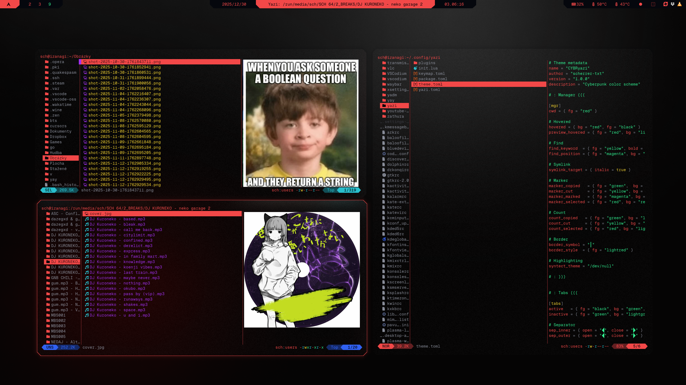

```
░▒▓█▓▒░░▒▓█▓▒░░▒▓██████▓▒░░▒▓████████▓▒░▒▓█▓▒░ 
░▒▓█▓▒░░▒▓█▓▒░▒▓█▓▒░░▒▓█▓▒░      ░▒▓█▓▒░▒▓█▓▒░ 
░▒▓█▓▒░░▒▓█▓▒░▒▓█▓▒░░▒▓█▓▒░    ░▒▓██▓▒░░▒▓█▓▒░ 
 ░▒▓██████▓▒░░▒▓████████▓▒░  ░▒▓██▓▒░  ░▒▓█▓▒░ 
   ░▒▓█▓▒░   ░▒▓█▓▒░░▒▓█▓▒░░▒▓██▓▒░    ░▒▓█▓▒░ 
   ░▒▓█▓▒░   ░▒▓█▓▒░░▒▓█▓▒░▒▓█▓▒░      ░▒▓█▓▒░ 
   ░▒▓█▓▒░   ░▒▓█▓▒░░▒▓█▓▒░▒▓████████▓▒░▒▓█▓▒░ 
```

# Result
</td>

# Steps
### 1. Install yazi
```sh
sudo pacman -S yazi
```
### 2. Create theme file
```sh
$EDITOR ~/.config/yazi/CYBRyazi.theme
```
### 3. Insert [CYBRyazi](CYBRyazi.toml)
### 4. Restart yazi
```sh
killall yazi && yazi
```
